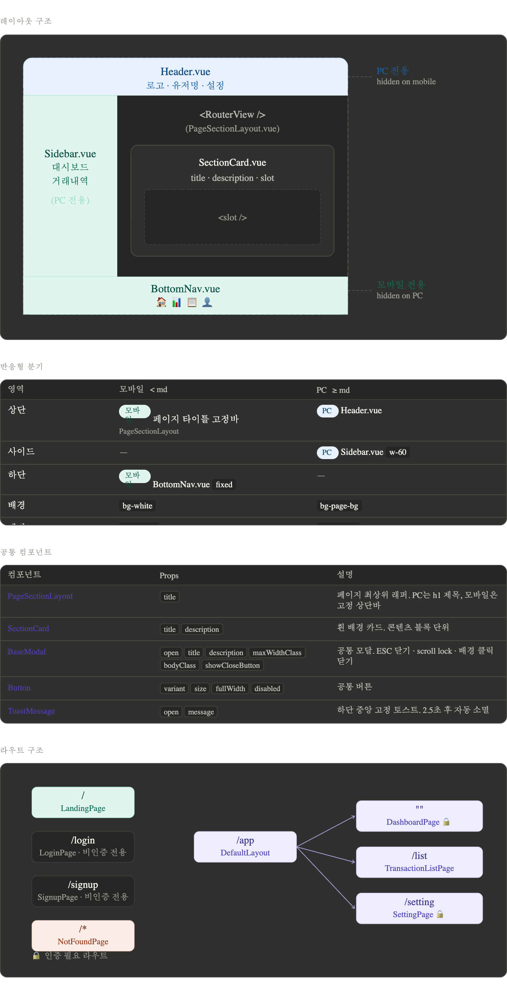

# KB 스켈레톤 프로젝트 - 가계부

# 목차

- [1. 프로젝트 소개](#1-프로젝트-소개)
- [2. 팀원 구성](#2-팀원-구성)
- [3. 기술 스택](#3-기술-스택)
- [4. 주요 기능](#4-주요-기능)
- [5. 폴더 구조](#5-폴더-구조)
- [6. 컴포넌트 설계](#6-컴포넌트-설계)
- [7. 구현 결과 화면](#7-구현-결과-화면)
- [8. 프로젝트 후기](#8-프로젝트-후기)
- [프로젝트 셋팅](#프로젝트-셋팅)
- [실행방법](#실행방법)

## 1. 프로젝트 소개

> 수입과 지출을 기록하고 월별 재정을 한눈에 확인할 수 있는 가계부 서비스

- **기간:** 2026.04.07 ~ 2026.04.13 (5일)
- **배포 링크:** [배포 링크](https://kb-4dollar.github.io/4dollar/#/app)

<!-- TODO: 아키텍쳐(프로젝트 구조, CI/CD) 내용 추가-->

## 2. 팀원 구성

<!-- TODO: 팀원 정보 채우기 -->

| 이름   | 역할 | 담당 기능 |
| ------ | ---- | --------- |
| 채수연 | 팀장 | - 프로젝트 셋팅, 공통 레이아웃&컴포넌트&스타일 정리, 거래내역 등록/수정 개발, 배포 환경 구축        |
| 이승영 | 팀원 | - 백엔드 공통 유틸 작성, 리스트 페이지 개발        |
| 고현석 | 팀원 | - 기능 명세 관리, 대시보드 개발 - 소비패턴 분석, 캘린더 뷰        |
| 박신형 | 팀원 | - 화면설계서 작성, 공통 에러처리, 로그인/회원가입, 사용자 프로필 개발, 랜딩페이지, 반응형 작업         |


## 3. 기술 스택


## 4. 주요 기능

<!-- TODO: 구현한 기능 목록 채우기 -->

| 기능           | 설명                                           |
| -------------- | ---------------------------------------------- |
| 수입/지출 등록 | 날짜, 금액, 카테고리, 메모 입력 후 저장        |
| 거래 내역 조회 | 전체 내역 목록 확인                            |
| 필터링         | 날짜, 카테고리, 수입/지출 유형별 필터          |
| 월별 요약      | 총 수입, 총 지출, 순이익 요약 표시             |
| 소비 패턴 분석 | 사용자 소비 패턴 분석하여 팩트폭행 잔소리 기능 |

## 5. 폴더 구조

```text
src/
├── api/                # API 통신 관련
│   ├── client/         # Axios 인스턴스 및 인터셉터
│   ├── constants/      # 열거형 상수, 에러/메시지 코드
│   └── services/       # 인증, 거래, 통계 서비스
├── components/         # 재사용 컴포넌트
│   ├── common/         # 레이아웃, 헤더, 네비게이션 등 공통 컴포넌트
│   ├── dashboard/      # 대시보드 전용 차트 및 위젯
│   ├── landing/        # 랜딩 페이지 섹션 컴포넌트
│   ├── transaction/    # 거래 등록/수정/상세 컴포넌트
│   └── ui/             # 버튼, 모달, 토스트 등 기본 UI 컴포넌트
├── layouts/            # 페이지 공통 레이아웃
├── pages/              # 라우트별 페이지 컴포넌트
├── router/             # Vue Router 라우트 정의
├── stores/             # Pinia 상태 관리 (인증, 거래)
├── style/              # 전역 CSS 및 디자인 토큰
└── utils/              # 유효성 검증, 에러 처리, 태그 파싱 등 유틸
```

## 6. 컴포넌트 설계



## 7. 구현 결과 화면

<!-- TODO: 완성된 화면 스크린샷 삽입 -->
<!-- 예시:  -->

## 8. 프로젝트 후기

<!-- TODO: 팀원별 후기 채우기 -->

| 이름   | 후기 |
| ------ | ---- |
| 채수연 | -    |
| 이승영 | -    |
| 고현석 | -    |
| 박신형 | -    |

---

## 프로젝트 셋팅

로컬 개발 환경 설정

1. 레포지토리 클론

```bash
git clone https://github.com/KB-4dollar/4dollar.git
cd 4dollar
git checkout dev
```

2. 패키지 설치

```bash
npm install
```

3. 환경변수 설정
   프로젝트 루트에 .env.dev 파일 생성 후 아래 내용 입력 (API URL은 따로 받기)
   `VITE_API_URL=여기에*받은*URL*입력`
4. 개발 서버 실행

```bash
   npm run dev
```

5. 배포
   - dev 브랜치에 push하면 자동으로 배포(dev: https://KB-4dollar.github.io/4dollar)

## 실행방법

프론트엔드와 json-server 동시 실행

```shell
npm run dev
```

프론트엔드만 실행

```shell
npm run dev:web
```

json-server만 실행

```shell
npm run db
```

배포 환경(Railway)에서는 아래 명령으로 json-server가 실행됩니다.

```shell
npm run start
```
