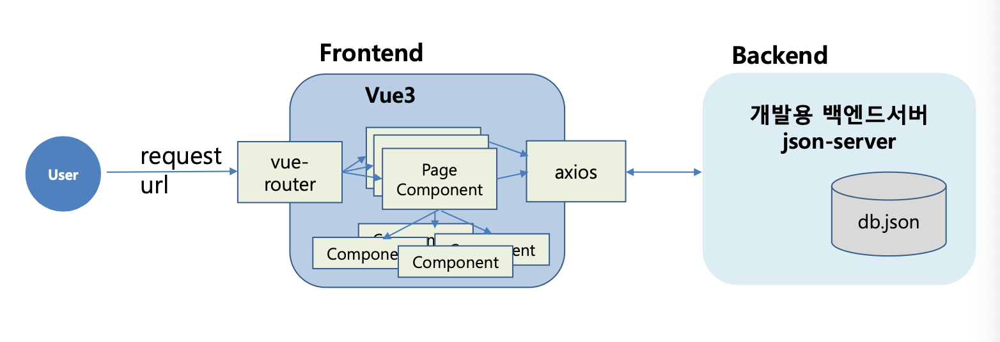

# 프로젝트 개요

- 프로젝트 일정: 2026.04.07(화) ~ 2025.04.13(월), 5일
- 프로젝트 주제: 가계부 서비스 앱
- 프로젝트 목표
  - 수업시간에 배운 기술 요소를 실제 서비스에 접목해 봄으로써 각 개인의 프로그래밍 능력 향상
  - 서비스(프로젝트) 개발 시 거치게 되는 기획, 설계, 코딩, 테스트, 배포의 각 단계를 실제 경험해 볼 수 있는 기회가 됨
  - 팀 프로젝트 진행 시 팀원 간의 협력 및 충돌 시 조정 과정 경험
  - 프로그램 소스의 형상 관리(버전 관리) 기법 배양
  - 향후 진행될 파이널 프로젝트의 진행 절차를 사전에 경험해 봄

# 프로젝트 일정

(변동 가능)

- 1일차- 조 구성, 참조 사이트 조사(벤치마킹) 및 구현 기능 기획
- 1일차 – UI 설계(url 결정, 화면 스토리보드), 백엔드(데이터 json 구조 결정), 프로젝트 골격 구성, 깃 연동
- 2일차 – 구현
- 3일차 – 구현
- 4일차 – 구현
- 5일차 – 구현 마무리, 문서화, 깃 정리, 발표

# 프로젝트 구현 명세

### 기능 요구사항(필수)

- 수입/지출 기록
  - 날짜, 금액, 카테고리, 메모 등의 세부정보를 입력하여 기록
- 거래 내역 조회
  - 필터 기능을 통해 특정 조건에 맞는 거래 내역을 조회
    - 날짜/주간/월별/기간별, 카테고리 별 등 필터링 항목에 따른 요약 내역 조회

- 월별 재정 요약
  - 각 월의 수입, 지출, 순이익을 요약 표시 \*그래픽(차트) 처리는 선택 사항
- 데이터 저장
  - 데이터는 모두 json-server에 저장되어야 함

### 디자인 요구 사항

- 반응형 디자인
- 사용자 인터페이스 - 직관적인 UI

### 기술적 요구 사항

- 프론트엔드 구현 - vue3로 모던 웹 애플리케이션 구축
- composition API를 통한 앱 상태 관리
- 필수 기술 스택
  - vite project, Composition API 또는 Options API, vue-router, axios, components, pinia, 이벤트
  - json server(DB)
    - REST API, Sort, pagenation
- 선택 기술 스택
  - figma, bootstrap5, fontawesome

# 프로젝트 아키텍처

# 제출물

- 기획 문서: pdf
- 화면 설계 문서: 스토리보드
- 소스코드
- 발표자료

# 화면설계(필수)

기본 레이아웃

- 상단바: 날짜 선택기, 설정 및 프로필 접근 버튼
- 요약 카드: 이번 달 총 수입/지출, 순수익 보여주는 카드
- 최근 거래 목록: 날짜와 함께 표시되는 최근 거래 목록
- 빠른 추가 버튼: 화면 하단에 고정된 버튼, 새로운 거래를 신속히 추가

메인 대시보드(홈화면)

- 기능:
  - 최근 거래 내역 요약
  - 월별 수입 및 지출 요약
  - 빠른 추가 버튼

거래 내역

- 기능:
  - 거래 내역 전체 보기
  - 기간별, 카테고리별 필터링
  - 각 거래에 대한 세부정보 보기 및 수정
- 구성요소:
  - 필터 바: 날짜 및 카테고리 별 필터링 옵션
  - 거래목록: 각 거래 날짜, 카테고리, 금액, 메모 표시
  - 수정 및 삭제 옵션: 각 거래 옆에 수정 및 삭제 버튼 제공

거래 등록 및 수정

- 기능:
  - 새로운 거래 추가 또는 기존 거래 수정
  - 거래 날짜, 금액, 카테고리, 메모 입력
- 구성 요소:
  - 입력폼(datepicker,input,selectbox,textarea), 저장버튼, 취소버튼

설정 및 프로필 관리

- 기능:
  - 사용자 설정 변경
  - 프로필 정보 관리
- 구성요소:
  - 사용자 정보: 이름, 이메일 등의 프로필 정보 표시 및 수정
