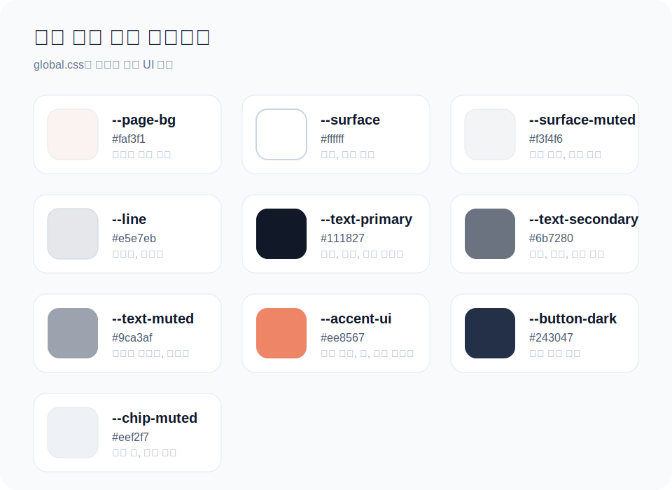
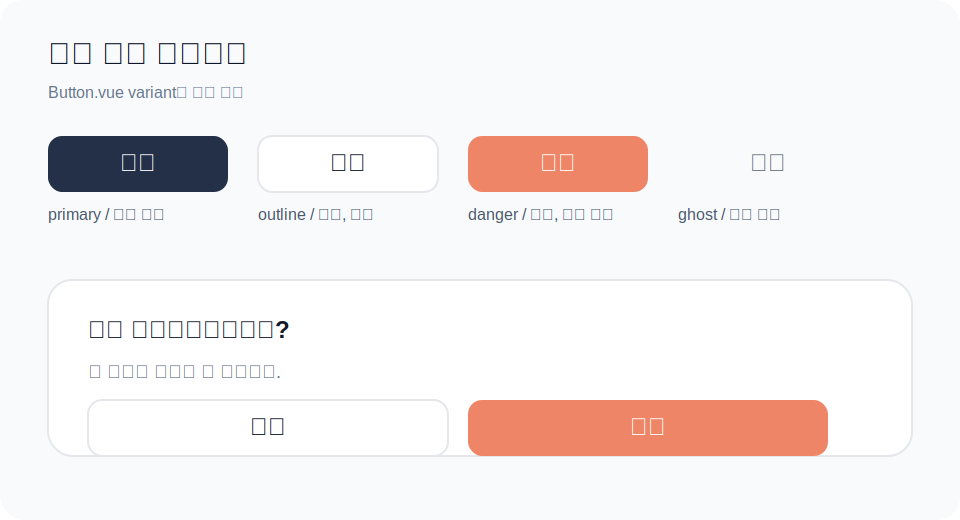

# 스타일 가이드

## 목차

- [목차](#목차)
- [1. 스타일링 원칙](#1-스타일링-원칙)
- [2. 브레이크포인트](#2-브레이크포인트)
- [3. 레이아웃 패턴](#3-레이아웃-패턴)
- [4. 디자인 토큰 사용 가이드](#4-디자인-토큰-사용-가이드)
- [5. 공통 버튼 컴포넌트](#5-공통-버튼-컴포넌트)
- [6. 반응형 텍스트 크기](#6-반응형-텍스트-크기)
- [7. 모바일 전용 처리](#7-모바일-전용-처리)

---

## 1. 스타일링 원칙

- Tailwind 유틸리티 클래스를 기본으로 사용한다.
- 하드코딩된 색상보다 `src/style/global.css`의 공통 토큰을 우선 사용한다.
- 공통 레이아웃은 직접 wrapper를 만들기보다 `PageSectionLayout`을 우선 사용한다.
- 반복되는 버튼 스타일은 공통 `Button.vue`를 우선 사용한다.

---

## 2. 브레이크포인트

Tailwind 기본 브레이크포인트를 그대로 사용한다. 모바일 퍼스트 원칙으로 작성한다.

| 접두사 | 기준        | 대상                    |
| ------ | ----------- | ----------------------- |
| (없음) | 모든 화면   | 모바일 기본             |
| `sm:`  | 640px 이상  | 큰 모바일 / 세로 태블릿 |
| `md:`  | 768px 이상  | 태블릿                  |
| `lg:`  | 1024px 이상 | 데스크탑                |

```html
<div class="grid grid-cols-1 md:grid-cols-2 lg:grid-cols-3 gap-4"></div>
```

---

## 3. 레이아웃 패턴

### 페이지 래퍼 — `PageSectionLayout` 공통 컴포넌트 사용

공통 페이지 레이아웃이 필요하면 직접 wrapper를 만들지 말고
`src/components/common/PageSectionLayout.vue`를 우선 사용한다.

- 배경색
- 최대 너비
- 상단 타이틀
- 흰색 섹션 카드

위 구조가 공통으로 적용된다.

```vue
<script setup>
import PageSectionLayout from '@/components/common/PageSectionLayout.vue';
</script>

<template>
  <PageSectionLayout title="거래내역">
    <!-- 페이지 내용 -->
  </PageSectionLayout>
</template>
```

페이지 분기만 담당하는 상위 페이지에서는 레이아웃을 직접 감싸지 않고,
실제 화면 컴포넌트 내부에서 `PageSectionLayout`을 사용하는 방식을 권장한다.

```vue
<template>
  <TransactionForm v-if="isCreateMode" />
  <TransactionDetail v-else />
</template>
```

```vue
<script setup>
import PageSectionLayout from '@/components/common/PageSectionLayout.vue';
</script>

<template>
  <PageSectionLayout title="입출금 입력">
    <!-- form 내용 -->
  </PageSectionLayout>
</template>
```

---

## 4. 디자인 토큰 사용 가이드

공통 색상은 `src/style/global.css`에 정의한다. 컴포넌트에서는 색상 코드나 `gray-xxx` 계열 대신 역할 기반 토큰을 우선 사용한다.

### 색상 스와치 예시

GitHub에서 바로 보이는 미리보기는 아래 SVG를 참고한다.



아래 표에서는 토큰명, 실제 값, Tailwind 클래스, 대표 사용처를 같이 확인할 수 있다.

| 토큰 | 값 | Tailwind 클래스 예시 | 사용처 |
| --- | --- | --- | --- |
| `--page-bg` | `#faf3f1` | `bg-page-bg` | 페이지 전체 배경 |
| `--surface` | `#ffffff` | `bg-surface` | 카드, 흰색 섹션 |
| `--surface-muted` | `#f3f4f6` | `bg-surface-muted` | 입력 박스, 연한 영역 |
| `--line` | `#e5e7eb` | `border-line` | 구분선, 테두리 |
| `--text-primary` | `#111827` | `text-text-primary` | 제목, 금액, 핵심 텍스트 |
| `--text-secondary` | `#6b7280` | `text-text-secondary` | 라벨, 날짜, 보조 설명 |
| `--text-muted` | `#9ca3af` | `text-text-muted` | 비활성 텍스트, 아이콘 |
| `--accent-ui` | `#ee8567` | `bg-accent-ui`, `text-accent-ui` | 활성 버튼, 탭, 강조 텍스트 |
| `--accent-ui-foreground` | `#ffffff` | `text-accent-ui-foreground` | 오렌지 버튼 위 글자 |
| `--button-dark` | `#243047` | `bg-button-dark` | 진한 버튼 배경 |
| `--button-dark-foreground` | `#ffffff` | `text-button-dark-foreground` | 진한 버튼 위 글자 |
| `--chip-muted` | `#eef2f7` | `bg-chip-muted` | 회색 칩, 배지 배경 |
| `--chip-muted-foreground` | `#6b7280` | `text-chip-muted-foreground` | 회색 칩 글자 |

### 토큰 적용 예시 미리보기

위 SVG에서 실제 색상 사용 예시까지 함께 확인할 수 있다.

### 사용 원칙

- 색상 코드를 컴포넌트에 직접 쓰지 않는다.
- `text-gray-500`, `bg-white`처럼 의미가 약한 유틸보다 토큰을 우선한다.
- 새 색이 필요하면 먼저 `global.css`에 토큰으로 추가한 뒤 사용한다.
- 라이트/다크 모드를 같이 유지하려면 `:root`와 `.dark`를 함께 수정한다.

### 권장 예시

```html
<section
  class="border-line bg-surface text-text-primary shadow-[0_8px_24px_var(--panel-shadow)]"
>
  <p class="text-text-secondary">2026-04-07</p>
  <button class="bg-accent-ui text-accent-ui-foreground">전체</button>
  <button class="bg-button-dark text-button-dark-foreground">지출</button>
  <span class="bg-chip-muted text-chip-muted-foreground">고정지출</span>
</section>
```

### 비권장 예시

```html
<section class="border-gray-200 bg-white text-gray-900 shadow-lg">
  <p class="text-gray-500">2026-04-07</p>
  <button class="bg-orange-400 text-white">전체</button>
</section>
```

### 새 토큰 추가 순서

1. `@theme inline`에 `--color-...` 매핑 추가
2. `:root`에 라이트 모드 값 추가
3. `.dark`에 다크 모드 값 추가
4. 컴포넌트에서 Tailwind 토큰 클래스로 사용

예시:

```css
@theme inline {
  --color-status-success: var(--status-success);
}

:root {
  --status-success: #22c55e;
}

.dark {
  --status-success: #4ade80;
}
```

---

## 5. 공통 버튼 컴포넌트

공통 버튼은 `src/components/common/Button.vue`를 사용한다. 새 화면에서 버튼이 필요하면 기본 HTML `button`을 바로 만들기보다 공통 버튼을 먼저 검토한다.

### 지원 props

| props       | 타입      | 기본값      | 설명                |
| ----------- | --------- | ----------- | ------------------- |
| `variant`   | `String`  | `'primary'` | 버튼 스타일 종류    |
| `size`      | `String`  | `'md'`      | 버튼 크기           |
| `type`      | `String`  | `'button'`  | 버튼 타입           |
| `disabled`  | `Boolean` | `false`     | 비활성화            |
| `fullWidth` | `Boolean` | `false`     | 가로 전체 너비 사용 |

### variant 종류

| 값        | 스타일                |
| --------- | --------------------- |
| `primary` | 진한 기본 버튼        |
| `danger`  | 오렌지 강조/삭제 버튼 |
| `outline` | 흰 배경 + 테두리 버튼 |
| `ghost`   | 배경 없는 보조 버튼   |

### size 종류

| 값   | 스타일    |
| ---- | --------- |
| `sm` | 작은 버튼 |
| `md` | 기본 버튼 |
| `lg` | 큰 버튼   |

### 버튼 UI 미리보기

GitHub에서 바로 보이는 버튼 미리보기는 아래 SVG를 참고한다.



### 사용 예시

```vue
<script setup>
import Button from '@/components/common/Button.vue';
</script>

<template>
  <div class="flex gap-3">
    <Button>추가</Button>
    <Button variant="outline">취소</Button>
    <Button variant="danger">삭제</Button>
  </div>
</template>
```

```vue
<Button size="lg" fullWidth>저장</Button>
```

삭제 확인 모달처럼 2개 버튼을 나란히 둘 때 예시:

```vue
<div class="grid grid-cols-2 gap-4">
  <Button variant="outline" size="lg">취소</Button>
  <Button variant="danger" size="lg">삭제</Button>
</div>
```

### 삭제 모달 버튼 배치 미리보기

위 버튼 SVG 아래쪽 예시를 참고한다.

### 사용 원칙

- 진한 기본 액션은 `primary`를 사용한다.
- 삭제, 제거, 위험 액션은 `danger`를 사용한다.
- 취소, 닫기, 되돌리기는 `outline`을 우선 사용한다.
- 화면마다 다른 색 버튼을 새로 만들기 전에 `variant` 추가가 필요한지 먼저 검토한다.

---

## 6. 반응형 텍스트 크기

```html
<h1 class="text-xl md:text-2xl font-bold">대시보드</h1>
<p class="text-sm md:text-base text-muted-foreground">이번 달 요약</p>
```

---

## 7. 모바일 전용 처리

```html
<span class="hidden sm:inline">카테고리</span>
<button class="sm:hidden">...</button>
```
